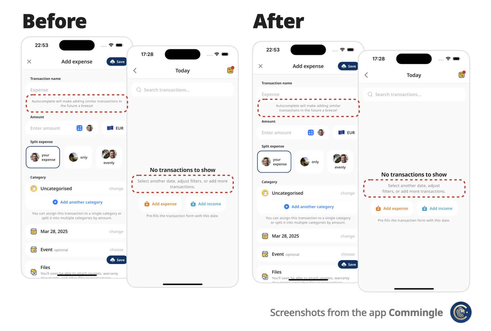

# Optimal Wrap Text

A Flutter Text replacement that wraps short multi-line text over similarly sized lines for better visual balance.



## ✨ Features

- Drop-in replacement for the `Text` widget
- Supports all `Text` attributes, including `style`, `textDirection` (RTL), `textHeightBehavior`…
- Automatically finds optimal line breaks — no more manual `\n`
- Adjusts to different screen sizes and text scaling

## 📐 Why?

Instead of awkward standard line breaks like these:

```
My slightly longer text that will span 2 or
3 lines

My slightly longer text that will span 2 or
                  3 lines
```

You get cleaner, balanced output like these:

```
My slightly longer text that 
will span 2 or 3 lines

        My slightly longer text that       
           will span 2 or 3 lines
```

Perfect for small, informative footnotes or short multi-line messages that deserve to look good.

## 🚀 Getting started

Add `optimal_wrap_text` to your `pubspec.yaml`:

```yaml
dependencies:
  ...
  optimal_wrap_text: ^1.0.0
  ...
```

Then import it:

```dart
import 'package:optimal_wrap_text/optimal_wrap_text.dart';
```

Use it just like the `Text` widget:

```dart
OptimalWrapText(
  'My slightly longer text that will span 2 or 3 lines',
)
```

With all supported properties:

```dart
OptimalWrapText(
  'My slightly longer text that will span 2 or 3 lines',
  key: ...
  style: Theme.of(context).textTheme.bodyLarge,
  textAlign: TextAlign.center,
  strutStyle: ...,
  textDirection: ...,
  locale: ...,
  softWrap: ...,
  textScaler: ...,
  semanticsLabel: ...,
  textWidthBasis: ...,
  textHeightBehavior: ...,
  selectionColor: ...,
)
```

📌 For centered or right-aligned text, you may still want to wrap it in a `Center`, `Align`, or `Row`, just like with a regular `Text` widget.


## 🧠 How does it work?

1. **Optimal Wrap Text** uses `TextPainter` to determine how many lines your text will take at full available width in the given widget tree.

2. It runs a binary search to find the narrowest width that still fits in the same number of lines — ensuring optimal wrapping.

   e.g. 
   ```
   300px → 2 lines
   150px → 4 lines ❌
   225px → 2 lines ✅
   188px → 3 lines ❌
   206px → 2 lines ✅
   ... and so on
   ```

   Worst-case scenario for mobile screen widths (e.g. iPhone) is about 9 iterations, but typical cases resolve in 6 attempts.

3.	It wraps the final Text in a SizedBox constrained to that optimal width.

## ⚠️ Known Limitations

`OptimalWrapText` does not support `maxLines` attribute. It’s by design as it is intended to display short messages that should always be fully displayed.

It uses `LayoutBuilder` to get width in the given widget tree, which doesn’t work inside some slivers, such as `SliverFillRemaining`, which rely on intrinsic sizing.

💡 You can work around this by passing a manual width:

```dart
CustomScrollView(
  slivers: [
    ...,
    SliverFillRemaining(
      child: Padding(
        padding: EdgeInsets.only(left: 15, right: 30),
        child: OptimalWrapText(
          'My slightly longer text that will span 2 or 3 lines',
          width: MediaQuery.sizeOf(context).width - 15 - 30
        ),
      )
    ),
  ]
)
```

## 📄 Copyright and License

**Optimal Wrap Text** is maintained by Chris Rutkowski as part of the [Commingle](https://commingle.app) app, and open-sourced under the MIT License.
